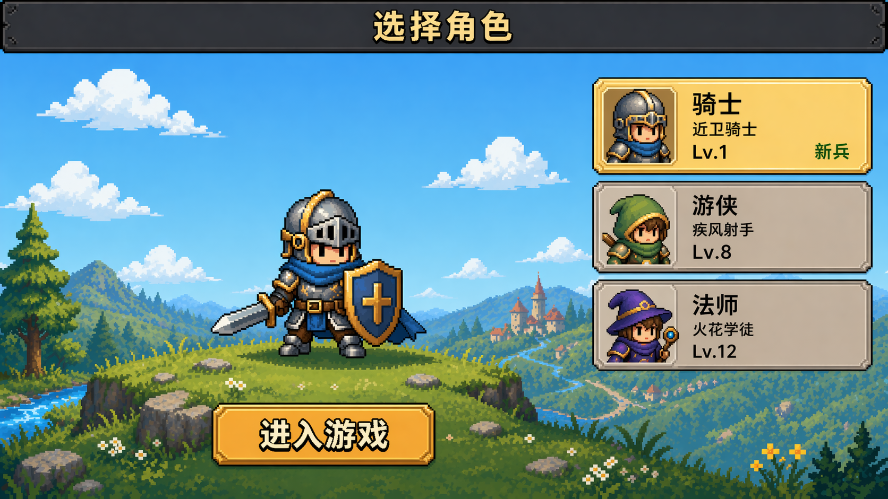

# Pixel Knight 设计基线 v2

日期：2026-04-24  
范围：角色选择首页  
状态：效果图 review 基线，暂不代表已实现页面

## 目录

- [角色选择首页效果图记录](./角色选择首页效果图记录.md)
- [01-角色选择首页视觉基线](./01-角色选择首页视觉基线.md)
- [02-角色选择首页交互边界](./02-角色选择首页交互边界.md)
- [03-角色选择首页迭代记录](./03-角色选择首页迭代记录.md)

## 推荐基线

当前推荐稿：

文件路径：

- `docs/pixel-knight-design-baseline-v2/concepts/character-select-home-clean-v3.png`

## 核心结论

- 角色选择页就是游戏首页，不提供返回入口。
- 当前页面只负责选择用户已有角色并进入游戏，不承担职业创建、职业介绍和赛季运营入口。
- 角色列表中的每个角色都必须显示对应头像，不能使用通用盾牌、徽章或抽象占位符。
- `进入游戏` 按钮应与当前角色展示区域绑定，放在角色下方或同一视觉分组内，而不是作为远离角色的全局底栏按钮。
- 当前基线只展示已存在职业：骑士、游侠、法师。
- 整体风格应保持明亮、干净、低装饰密度的像素 ARPG 菜单感。

## 实现提醒

该目录记录的是视觉方向和产品取舍。后续实现前需要重新核对当前代码中真实可用功能，避免把效果图中的装饰元素扩展为额外功能。
